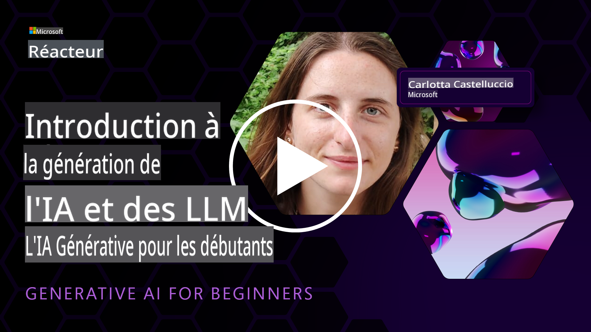
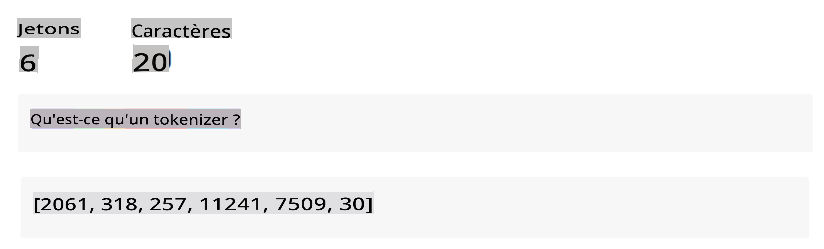
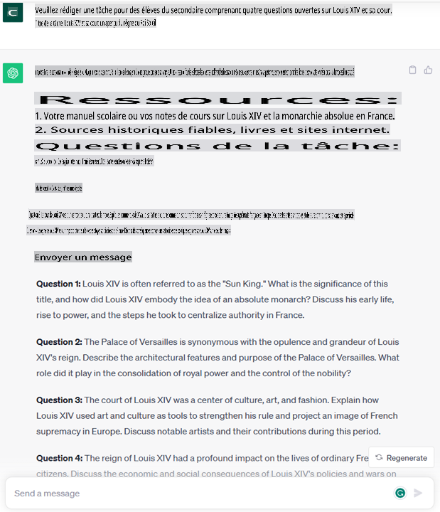
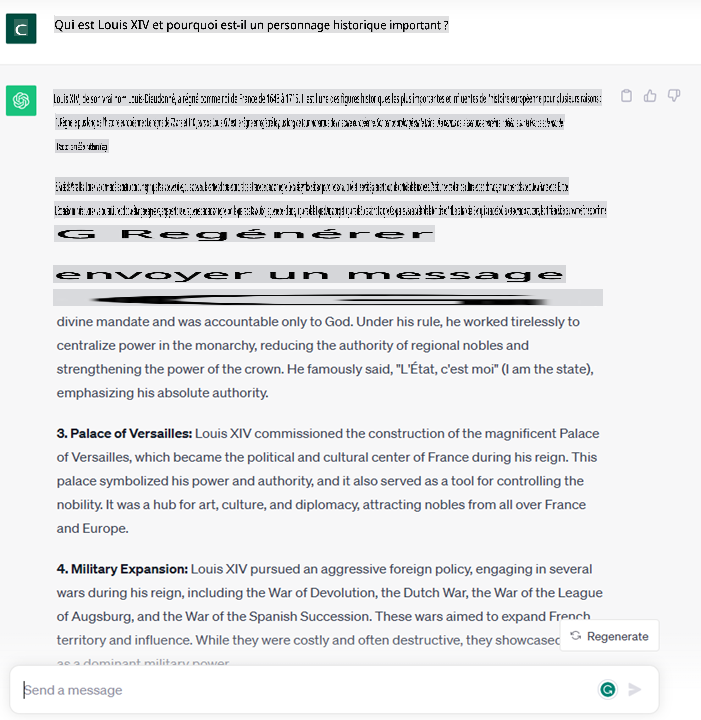

# Introduction à l'IA générative et aux grands modèles de langage

*(Cliquez sur l'image ci-dessus pour voir la vidéo de cette leçon)*

L'IA générative est une intelligence artificielle capable de générer du texte, des images et d'autres types de contenu. Ce qui en fait une technologie fantastique, c'est qu'elle démocratise l'IA, tout le monde peut l'utiliser avec aussi peu qu'une invitation de texte, une phrase écrite dans un langage naturel. Il n'est pas nécessaire d'apprendre un langage comme Java ou SQL pour accomplir quelque chose de valable, il suffit d'utiliser votre langue, de dire ce que vous voulez et une suggestion d'un modèle d'IA en ressort. Les applications et l'impact de cela sont énormes, vous écrivez ou comprenez des rapports, écrivez des applications et bien plus encore, tout en quelques secondes.

Dans ce programme, nous explorerons comment notre start-up exploite l'IA générative pour débloquer de nouveaux scénarios dans le monde de l'éducation et comment nous abordons les défis inévitables associés aux implications sociales de son application et aux limites technologiques.

## Introduction

Cette leçon couvrira :

* Introduction au scénario commercial : notre idée de start-up et notre mission.
* IA générative et comment nous sommes arrivés au paysage technologique actuel.
* Fonctionnement interne d'un grand modèle de langage.
* Capacités principales et cas d'utilisation pratique des grands modèles de langage.

## Objectifs d'apprentissage

Après avoir terminé cette leçon, vous comprendrez :

* Ce qu'est l'IA générative et comment les grands modèles de langage fonctionnent.
* Comment vous pouvez exploiter les grands modèles de langage pour différents cas d'utilisation, en mettant l'accent sur les scénarios éducatifs.

## Scénario : notre start-up éducative

L'Intelligence Artificielle Générative (IA) représente le summum de la technologie de l'IA, repoussant les limites de ce qui était autrefois considéré comme impossible. Les modèles d'IA générative ont plusieurs capacités et applications, mais pour ce programme, nous explorerons comment elle révolutionne l'éducation grâce à une start-up fictive. Nous nous référerons à cette start-up comme *notre start-up*. Notre start-up travaille dans le domaine de l'éducation avec une déclaration de mission ambitieuse :

> *améliorer l'accessibilité à l'apprentissage, à l'échelle mondiale, en garantissant un accès équitable à l'éducation et en fournissant des expériences d'apprentissage personnalisées à chaque apprenant, selon ses besoins.*

Notre équipe de start-up est consciente que nous ne pourrons pas atteindre cet objectif sans exploiter l'un des outils les plus puissants de notre époque - les grands modèles de langage (LLM).

On s'attend à ce que l'IA générative révolutionne la façon dont nous apprenons et enseignons aujourd'hui, avec des étudiants ayant à leur disposition des enseignants virtuels 24 heures sur 24 qui fournissent de vastes quantités d'informations et d'exemples, et des enseignants capables d'utiliser des outils innovants pour évaluer leurs élèves et donner des commentaires.

Pour commencer, définissons quelques concepts et terminologies de base que nous utiliserons tout au long du programme.

## Comment avons-nous obtenu l'IA générative ?

Malgré l'extraordinaire *hype* créé ces derniers temps par l'annonce de modèles d'IA générative, cette technologie remonte à plusieurs décennies, les premiers efforts de recherche datant des années 60. Nous en sommes maintenant à un point où l'IA possède des capacités cognitives humaines, comme la conversation, comme le montrent par exemple [OpenAI ChatGPT](https://openai.com/chatgpt) ou [Bing Chat](https://www.microsoft.com/edge/features/bing-chat?WT.mc_id=academic-105485-koreyst), qui utilise également un modèle GPT pour les conversations Bing.

Pour revenir en arrière, les premiers prototypes d'IA consistaient en des chatbots dactylographiés, reposant sur une base de connaissances extraite d'un groupe d'experts et représentée dans un ordinateur. Les réponses de la base de connaissances étaient déclenchées par des mots-clés apparaissant dans le texte d'entrée.
Cependant, il est rapidement devenu évident que cette approche, utilisant des chatbots dactylographiés, ne fonctionnait pas bien à grande échelle.

### Une approche statistique de l'IA : l'apprentissage automatique

Un tournant est survenu pendant les années 90, avec l'application d'une approche statistique à l'analyse de texte. Cela a conduit au développement de nouveaux algorithmes - connus sous le nom d'apprentissage automatique - capables d'apprendre des modèles à partir de données, sans être explicitement programmés. Cette approche permet à une machine de simuler la compréhension du langage humain : un modèle statistique est entraîné sur des paires texte-étiquette, permettant au modèle de classifier un texte d'entrée inconnu avec une étiquette prédéfinie représentant l'intention du message.

### Réseaux neuronaux et assistants virtuels modernes

Plus récemment, l'évolution technologique du matériel, capable de traiter de plus grandes quantités de données et de calculs plus complexes, a encouragé la recherche dans les domaines de l'IA, conduisant au développement d'algorithmes d'apprentissage automatique avancés - appelés réseaux neuronaux ou algorithmes d'apprentissage profond.

Les réseaux neuronaux (et en particulier les réseaux neuronaux récurrents - RNN) ont considérablement amélioré le traitement du langage naturel, permettant la représentation du sens du texte de manière plus significative, valorisant le contexte d'un mot dans une phrase.

C'est la technologie qui a alimenté les assistants virtuels nés dans la première décennie du nouveau siècle, très compétents pour interpréter le langage humain, identifier un besoin et effectuer une action pour le satisfaire - comme répondre avec un script prédéfini ou consommer un service tiers.

### Aujourd'hui, l'IA générative

C'est ainsi que nous sommes arrivés à l'IA générative d'aujourd'hui, qui peut être considérée comme une sous-catégorie de l'apprentissage profond.

Après des décennies de recherche dans le domaine de l'IA, une nouvelle architecture de modèle - appelée *Transformer* - a surmonté les limites des RNN, étant capable de prendre en compte des séquences de texte beaucoup plus longues en entrée. Les Transformateurs sont basés sur le mécanisme d'attention, permettant au modèle de donner différents poids aux entrées qu'il reçoit, « prêtant plus d'attention » là où les informations les plus pertinentes sont concentrées, indépendamment de leur ordre dans la séquence de texte.

La plupart des récents modèles d'IA générative - également connus sous le nom de grands modèles de langage (LLM), car ils travaillent avec des entrées et des sorties textuelles - sont en effet basés sur cette architecture. Ce qui est intéressant avec ces modèles - entraînés sur une énorme quantité de données non étiquetées provenant de sources diverses telles que des livres, des articles et des sites Web - c'est qu'ils peuvent être adaptés à une grande variété de tâches et générer un texte grammaticalement correct avec une apparence de créativité. Ainsi, non seulement ont-ils considérablement amélioré la capacité d'une machine à « comprendre » un texte d'entrée, mais ils ont également permis à leur capacité de générer une réponse originale en langage humain.

## Comment fonctionnent les grands modèles de langage ?

Dans le prochain chapitre, nous allons explorer différents types de modèles d'IA générative, mais pour l'instant, examinons comment fonctionnent les grands modèles de langage, en mettant l'accent sur les modèles OpenAI GPT (Generative Pre-trained Transformer).

* **Tokenizer, texte en nombres** : Les grands modèles de langage reçoivent un texte en entrée et génèrent un texte en sortie. Cependant, étant des modèles statistiques, ils fonctionnent beaucoup mieux avec des nombres qu'avec des séquences de texte. C'est pourquoi chaque entrée dans le modèle est traitée par un tokenizer, avant d'être utilisée par le modèle principal. Un jeton est un morceau de texte - composé d'un nombre variable de caractères, donc la tâche principale du tokenizer est de diviser l'entrée en un tableau de jetons. Ensuite, chaque jeton est associé à un index de jeton, qui est l'encodage entier du fragment de texte d'origine.

* **Prédiction des jetons de sortie** : Étant donné n jetons en entrée (avec un maximum n variant d'un modèle à l'autre), le modèle est capable de prédire un jeton en sortie. Ce jeton est ensuite incorporé dans l'entrée de la prochaine itération, dans un modèle de fenêtre en expansion, permettant une meilleure expérience utilisateur pour obtenir une (ou plusieurs) phrase en réponse. C'est pourquoi, si vous avez déjà joué avec ChatGPT, vous avez peut-être remarqué que parfois il semble s'arrêter au milieu d'une phrase.

* **Processus de sélection, distribution de probabilité** : Le jeton de sortie est choisi par le modèle en fonction de sa probabilité d'apparaître après la séquence de texte actuelle. C'est parce que le modèle prédit une distribution de probabilité sur tous les « jetons suivants » possibles, calculée en fonction de son entraînement. Cependant, ce n'est pas toujours le jeton avec la probabilité la plus élevée qui est choisi dans la distribution résultante. Un degré de hasard est ajouté à ce choix, de manière à ce que le modèle agisse de manière non déterministe - nous n'obtenons pas la même sortie pour la même entrée. Ce degré de hasard est ajouté pour simuler le processus de pensée créative et peut être réglé à l'aide d'un paramètre de modèle appelé température.

## Comment notre start-up peut-elle exploiter les grands modèles de langage ?

Maintenant que nous avons une meilleure compréhension du fonctionnement interne d'un grand modèle de langage, voyons quelques exemples pratiques des tâches les plus courantes qu'ils peuvent effectuer assez bien, en gardant à l'esprit notre scénario commercial.
Nous avons dit que la principale capacité d'un grand modèle de langage est de *générer un texte à partir de zéro, à partir d'une entrée textuelle, écrite dans un langage naturel*.

Mais quel type d'entrée et de sortie textuelles ?
L'entrée d'un grand modèle de langage est connue sous le nom de prompt, tandis que la sortie est connue sous le nom de completion, terme qui fait référence au mécanisme du modèle de générer le jeton suivant pour compléter l'entrée actuelle. Nous allons approfondir ce qu'est un prompt et comment le concevoir de manière à en tirer le meilleur parti de notre modèle. Mais pour l'instant, disons simplement qu'un prompt peut inclure :

* Une **instruction** spécifiant le type de sortie que nous attendons du modèle. Cette instruction peut parfois intégrer des exemples ou des données supplémentaires.

    1. Résumé d'un article, d'un livre, de critiques de produits et plus encore, ainsi qu'extraction d'informations à partir de données non structurées.
    
    

     
    
    2. Idéation créative et conception d'un article, d'un essai, d'une tâche ou plus encore.
    
    

     
    
* Une **question**, posée sous la forme d'une conversation avec un agent.
  

 

* Un morceau de **texte à compléter**, qui est implicitement une demande d'aide à l'écriture.
   

 

* Un morceau de **code** avec la demande d'explication et de documentation, ou un commentaire demandant de générer un morceau de code effectuant une tâche spécifique.

 

Les exemples ci-dessus sont assez simples et ne veulent pas être une démonstration exhaustive des capacités des grands modèles de langage. Ils veulent simplement montrer le potentiel d'utilisation de l'IA générative, en particulier mais pas exclusivement dans le contexte éducatif.

De plus, la sortie d'un modèle d'IA génératif n'est pas parfaite et parfois la créativité du modèle peut jouer contre lui, résultant en une sortie qui est une combinaison de mots que l'utilisateur humain peut interpréter comme une mystification de la réalité, ou elle peut être offensante. L'IA générative n'est pas intelligente - du moins dans la définition la plus complète de l'intelligence, incluant le raisonnement critique et créatif ou l'intelligence émotionnelle ; elle n'est pas déterministe, et elle n'est pas fiable, car des fabrications, telles que des références, des contenus et des déclarations erronées, peuvent être combinées avec des informations correctes et présentées de manière persuasive et confiante. Dans les leçons suivantes, nous aborderons toutes ces limites et nous verrons ce que nous pouvons faire pour les atténuer.

## Tâche

Votre tâche consiste à en savoir plus sur l'IA générative et à essayer d'identifier une zone où vous ajouteriez l'IA générative aujourd'hui qui ne l'a pas. Comment l'impact serait-il différent de le faire à l'ancienne, pouvez-vous faire quelque chose que vous ne pouviez pas faire auparavant, ou êtes-vous plus rapide ? Rédigez un résumé de 300 mots sur à quoi ressemblerait votre start-up de rêve en matière d'IA et incluez des en-têtes tels que « Problème », « Comment j'utiliserais l'IA », « Impact » et éventuellement un plan d'affaires.

Si vous avez effectué cette tâche, vous êtes peut-être même prêt à postuler à l'incubateur de Microsoft, [Microsoft for Startups Founders Hub](https://www.microsoft.com/startups?WT.mc_id=academic-105485-koreyst), nous offrons des crédits pour Azure, OpenAI, le mentorat et bien plus encore, vérifiez-le !

## Vérification des connaissances

Qu'est-ce qui est vrai à propos des grands modèles de langage ?

1. Vous obtenez exactement la même réponse à chaque fois.
1. Il fait les choses parfaitement, excellent pour ajouter des chiffres, produire du code fonctionnel, etc.
1. La réponse peut varier malgré l'utilisation du même prompt. Il est également excellent pour vous donner un premier jet de quelque chose, qu'il s'agisse de texte ou de code. Mais vous devez améliorer les résultats.

R : 3, un LLM est non déterministe, la réponse varie, cependant, vous pouvez contrôler sa variance via un paramètre de température. Vous ne devriez pas non plus vous attendre à ce qu'il fasse les choses parfaitement, il est là pour faire le gros du travail pour vous, ce qui signifie souvent que vous obtenez une bonne première tentative de quelque chose que vous devez progressivement améliorer.

## Excellent travail ! Poursuivez le voyage

Après avoir terminé cette leçon, consultez notre [collection d'apprentissage sur l'IA générative](https://aka.ms/genai-collection?WT.mc_id=academic-105485-koreyst) pour continuer à améliorer vos connaissances en IA générative !

Passons à la leçon 2 où nous examinerons

Avertissement : La traduction a été traduite à partir de l'original par un modèle d'IA et peut ne pas être parfaite. Veuillez vérifier le résultat et apporter les corrections nécessaires.