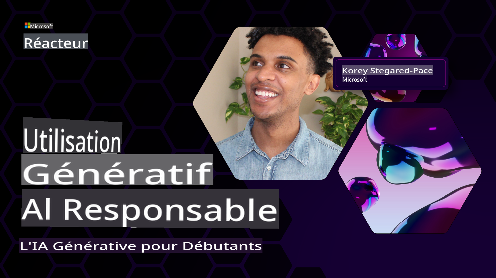
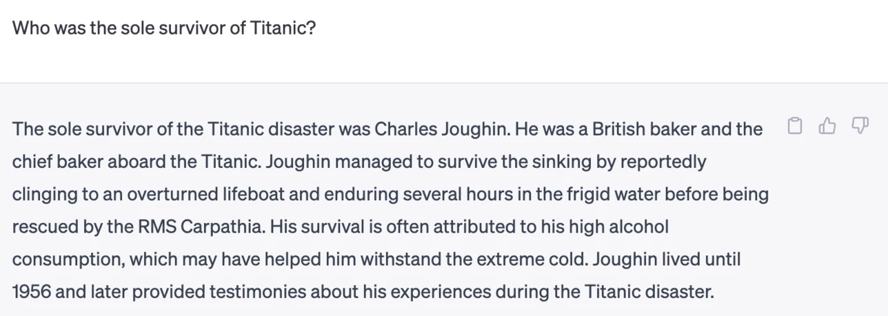
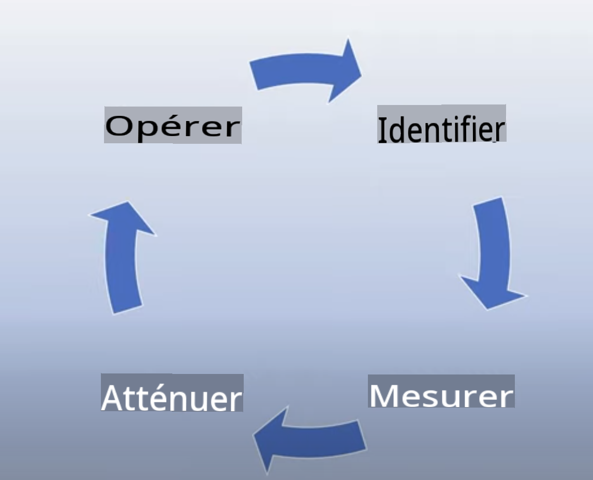
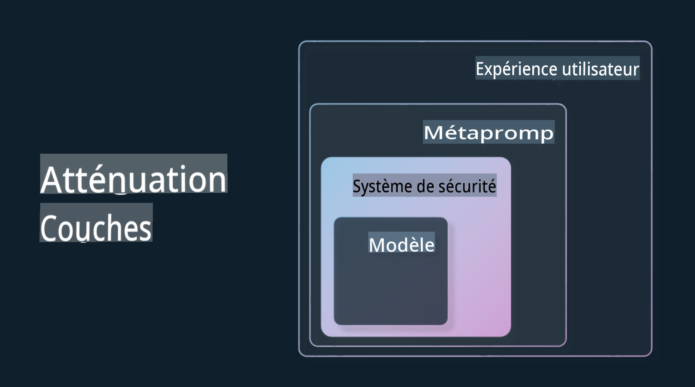

# Utiliser l'IA générative de manière responsable

> **Vidéo à venir**

Il est facile d'être fasciné par l'IA, et l'IA générative en particulier, mais il est important de considérer comment l'utiliser de manière responsable. Il faut prendre en compte des éléments tels que l'assurance que la sortie est équitable, non nuisible, etc. Ce chapitre vise à vous fournir le contexte nécessaire, ce qu'il faut prendre en compte et comment prendre des mesures actives pour améliorer votre utilisation de l'IA.

## Introduction

Cette leçon couvrira :

- Pourquoi vous devriez donner la priorité à l'IA responsable lors de la création d'applications d'IA générative.
- Les principes fondamentaux de l'IA responsable et comment ils se rapportent à l'IA générative.
- Comment mettre en pratique ces principes d'IA responsable grâce à des stratégies et des outils.

## Objectifs d'apprentissage

Après avoir terminé cette leçon, vous saurez :

- L'importance de l'IA responsable lors de la création d'applications d'IA générative.
- Quand penser et appliquer les principes fondamentaux de l'IA responsable lors de la création d'applications d'IA générative.
- Quels outils et stratégies sont à votre disposition pour mettre en pratique le concept d'IA responsable.

## Principes d'IA responsable

L'enthousiasme pour l'IA générative n'a jamais été aussi grand. Cet enthousiasme a attiré de nombreux nouveaux développeurs, de l'attention et des financements dans cet espace. Bien que cela soit très positif pour toute personne cherchant à construire des produits et des entreprises en utilisant l'IA générative, il est également important que nous procédions de manière responsable.

Tout au long de ce cours, nous nous concentrons sur la construction de notre startup et de notre produit d'éducation à l'IA. Nous utiliserons les principes de l'IA responsable : l'équité, l'inclusion, la fiabilité/sécurité, la sécurité et la confidentialité, la transparence et la responsabilité. Avec ces principes, nous explorerons comment ils se rapportent à notre utilisation de l'IA générative dans nos produits.

## Pourquoi devriez-vous donner la priorité à l'IA responsable

Lorsque vous construisez un produit, adopter une approche centrée sur l'humain en gardant à l'esprit les intérêts de vos utilisateurs conduit aux meilleurs résultats.

La particularité de l'IA générative est sa capacité à créer des réponses, des informations, des conseils et du contenu utiles pour les utilisateurs. Cela peut être fait sans de nombreuses étapes manuelles, ce qui peut conduire à des résultats très impressionnants. Sans une planification et des stratégies appropriées, cela peut également malheureusement conduire à des résultats nuisibles pour vos utilisateurs, votre produit et la société dans son ensemble.

Regardons quelques-uns (mais pas tous) de ces résultats potentiellement nuisibles :

### Hallucinations

Les hallucinations sont un terme utilisé pour décrire lorsque LLM produit un contenu qui est soit complètement absurde, soit quelque chose que nous savons est factuellement incorrect en fonction d'autres sources d'information.

Prenons par exemple que nous construisons une fonctionnalité pour notre startup qui permet aux étudiants de poser des questions historiques à un modèle. Un étudiant pose la question `Qui était le seul survivant du Titanic ?`

Le modèle produit une réponse comme celle ci-dessous :

> *(Source : [Flying bisons](https://flyingbisons.com?WT.mc_id=academic-105485-koreyst))*

C'est une réponse très confiante et approfondie. Malheureusement, elle est incorrecte. Même avec un minimum de recherche, on découvrirait qu'il y avait plus d'un survivant du désastre du Titanic. Pour un étudiant qui commence tout juste à rechercher ce sujet, cette réponse peut être suffisamment persuasive pour ne pas être remise en question et être traitée comme un fait. Les conséquences de cela peuvent conduire à ce que le système d'IA soit peu fiable et ait un impact négatif sur la réputation de notre startup.

À chaque itération de tout LLM donné, nous avons vu des améliorations de performance autour de la minimisation des hallucinations. Même avec cette amélioration, nous en tant que constructeurs et utilisateurs d'applications devons toujours rester conscients de ces limites.

### Contenu nuisible

Nous avons vu dans la section précédente quand un LLM produit des réponses incorrectes ou absurdes. Un autre risque dont nous devons être conscients est lorsque le modèle répond avec un contenu nuisible.

Le contenu nuisible peut être défini comme :

- Fournir des instructions ou encourager l'auto-mutilation ou la mutilation de certains groupes.
- Contenu haineux ou dégradant.
- Guider la planification de tout type d'attaque ou d'acte violent.
- Fournir des instructions sur la façon de trouver du contenu illégal ou de commettre des actes illégaux.
- Affichage de contenu sexuellement explicite.

Pour notre startup, nous voulons nous assurer que nous avons les bons outils et stratégies en place pour empêcher ce type de contenu d'être vu par les étudiants.

### Manque d'équité

L'équité est définie comme « s'assurer qu'un système d'IA est exempt de biais et de discrimination et qu'il traite tout le monde de manière équitable et égale ». Dans le monde de l'IA générative, nous voulons nous assurer que les points de vue exclusifs des groupes marginalisés ne sont pas renforcés par la sortie du modèle.

Ces types de sorties ne sont pas seulement destructeurs pour la création d'expériences de produit positives pour nos utilisateurs, mais ils causent également des préjudices supplémentaires à la société. En tant que constructeurs d'applications, nous devrions toujours garder à l'esprit une base d'utilisateurs large et diversifiée lors de la création de solutions avec l'IA générative.

## Comment utiliser l'IA générative de manière responsable

Maintenant que nous avons identifié l'importance de l'IA générative responsable, examinons 4 étapes que nous pouvons suivre pour construire nos solutions d'IA de manière responsable :

### Mesurer les dommages potentiels

En testant les logiciels, nous testons les actions attendues d'un utilisateur sur une application. De même, tester un ensemble diversifié de sollicitations que les utilisateurs sont le plus susceptibles d'utiliser est un bon moyen de mesurer les dommages potentiels.

Étant donné que notre startup construit un produit éducatif, il serait bon de préparer une liste de sollicitations liées à l'éducation. Cela pourrait être pour couvrir un certain sujet, des faits historiques et des sollicitations sur la vie étudiante.

### Atténuer les dommages potentiels

Il est maintenant temps de trouver des moyens de prévenir ou de limiter les dommages potentiels causés par le modèle et ses réponses. Nous pouvons examiner cela sous 4 couches différentes :

- **Modèle**. Choisir le bon modèle pour le bon cas d'utilisation. Les modèles plus grands et plus complexes comme GPT-4 peuvent causer plus de risques de contenu nuisible lorsqu'ils sont appliqués à des cas d'utilisation plus petits et plus spécifiques. L'utilisation de vos données de formation pour un affinage fin réduit également le risque de contenu nuisible.

- **Système de sécurité**. Un système de sécurité est un ensemble d'outils et de configurations sur la plateforme servant le modèle qui aident à atténuer les dommages. Un exemple de cela est le système de filtrage de contenu sur le service Azure OpenAI. Les systèmes doivent également détecter les attaques de jailbreak et les activités indésirables telles que les demandes de bots.

- **Méta-sollicitation**. Les méta-sollicitations et la mise à la terre sont des moyens de diriger ou de limiter le modèle en fonction de certains comportements et informations. Cela pourrait être l'utilisation d'entrées système pour définir certaines limites du modèle. De plus, fournir des sorties qui sont plus pertinentes pour la portée ou le domaine du système.

 Cela peut également être l'utilisation de techniques telles que la génération augmentée de récupération (RAG) pour que le modèle ne tire des informations que d'une sélection de sources de confiance. Il y a une leçon plus tard dans ce cours pour [la construction d'applications de recherche](../08-building-search-applications/README.md?WT.mc_id=academic-105485-koreyst)

- **Expérience utilisateur**. La dernière couche est là où l'utilisateur interagit directement avec le modèle via l'interface de notre application d'une manière ou d'une autre. De cette façon, nous pouvons concevoir l'interface utilisateur pour limiter l'utilisateur sur les types d'entrées qu'il peut envoyer au modèle ainsi que sur le texte ou les images affichées à l'utilisateur. Lors du déploiement de l'application d'IA, nous devons également être transparents sur ce que notre application d'IA générative peut et ne peut pas faire.

Nous avons une leçon entière consacrée à la [conception UX pour les applications d'IA](../12-designing-ux-for-ai-applications/README.md?WT.mc_id=academic-105485-koreyst)

- **Évaluer le modèle**. Travailler avec des LLM peut être difficile car nous n'avons pas toujours le contrôle sur les données sur lesquelles le modèle a été formé. Quoi qu'il en soit, nous devons toujours évaluer la performance et les sorties du modèle. Il est toujours important de mesurer l'exactitude, la similarité, la mise à la terre et la pertinence de la sortie du modèle. Cela aide à fournir de la transparence et de la confiance aux parties prenantes et aux utilisateurs.

### Utiliser une solution d'IA générative responsable

La construction d'une pratique opérationnelle autour de vos applications d'IA est la dernière étape. Cela comprend le partenariat avec d'autres parties de notre startup comme le département juridique et la sécurité pour nous assurer que nous sommes conformes à toutes les politiques réglementaires. Avant le lancement, nous voulons également élaborer des plans autour de la livraison, de la gestion des incidents et du retour en arrière pour éviter tout préjudice à nos utilisateurs en croissance.

## Outils

Bien que le développement de solutions d'IA responsable puisse sembler être beaucoup de travail, c'est un travail qui en vaut la peine. À mesure que le domaine de l'IA générative se développe, de plus en plus d'outils pour aider les développeurs à intégrer efficacement la responsabilité dans leurs flux de travail vont mûrir. Par exemple, le [Azure AI Content Safety](https://learn.microsoft.com/azure/ai-services/content-safety/overview?WT.mc_id=academic-105485-koreyst ) peut aider à détecter le contenu nuisible et les images via une demande d'API.

## Vérification des connaissances

Quelles sont certaines choses dont vous devez tenir compte pour assurer une utilisation responsable de l'IA ?

1. Que la réponse est correcte.
2. L'utilisation nuisible, que l'IA n'est pas utilisée à des fins criminelles.
3. Assurer que l'IA est exempte de biais et de discrimination.

R : Les options 2 et 3 sont correctes. L'IA responsable vous aide à considérer comment atténuer les effets nuisibles et les biais, et plus encore.

## 🚀 Défi

Lisez [Azure AI Content Saftey](https://learn.microsoft.com/azure/ai-services/content-safety/overview?WT.mc_id=academic-105485-koreyst) et voyez ce que vous pouvez adopter pour votre utilisation.

## Excellent travail, continuez votre apprentissage

Après avoir terminé cette leçon, consultez notre [collection d'apprentissage sur l'IA générative](https://aka.ms/genai-collection?WT.mc_id=academic-105485-koreyst) pour continuer à améliorer vos connaissances en IA générative !

Rendez-vous à la leçon 4 où nous examinerons les [Fondamentaux de l'ingénierie de sollicitations](../04-prompt-engineering-fundamentals/README.md?WT.mc_id=academic-105485-koreyst)!

Avertissement: La traduction a été traduite de son original par un modèle d'IA et peut ne pas être parfaite. Veuillez vérifier la sortie et apporter toutes les corrections nécessaires.