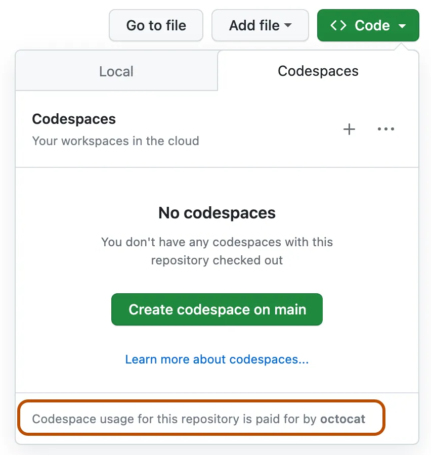

# 开始学习本课程

我们非常期待您开始学习本课程，并看到您用生成式 AI 建立的灵感！

为了确保您的成功，本页概述了设置步骤、技术要求以及在需要帮助时获取帮助的位置。

## 设置步骤

要开始学习本课程，您需要完成以下步骤。

### 1. Fork 该 Repo

将 [整个 Repo fork](https://github.com/microsoft/generative-ai-for-beginners/fork?WT.mc_id=academic-105485-koreyst) 到您自己的 GitHub 帐户中，以便能够更改任何代码并完成挑战。您还可以 [star (🌟) 该 Repo](https://docs.github.com/en/get-started/exploring-projects-on-github/saving-repositories-with-stars?WT.mc_id=academic-105485-koreyst) 以更轻松地找到它和相关的 Repo。

### 2. 创建 Codespace

为了在运行代码时避免任何依赖关系问题，我们建议在 [GitHub Codespaces](https://github.com/features/codespaces?WT.mc_id=academic-105485-koreyst) 中运行此课程。

这可以通过在 fork 后的版本中选择 `Code` 选项并选择 **Codespaces** 选项来创建。



### 3. 存储您的 API 密钥

保持 API 密钥的安全性非常重要，无论您构建任何类型的应用程序都是如此。我们建议不要直接在代码中存储任何 API 密钥。将这些详细信息提交到公共存储库中可能会导致安全问题，甚至可能会导致不必要的费用，如果被不良行为者使用。

## 如何在本地计算机上运行

要在本地计算机上运行代码，您需要安装某个版本的 [Python](https://www.python.org/downloads/?WT.mc_id=academic-105485-koreyst)。

然后，您需要克隆它：

```shell
git clone https://github.com/microsoft/generative-ai-for-beginners
cd generative-ai-for-beginners
```

一旦您检查好所有内容，就可以开始了！

### 安装 Miniconda（可选步骤）

[Miniconda](https://conda.io/en/latest/miniconda.html?WT.mc_id=academic-105485-koreyst) 是一个轻量级安装程序，用于安装 [Conda](https://docs.conda.io/en/latest?WT.mc_id=academic-105485-koreyst)、Python 以及一些包。Conda 本身是一个包管理器，它使设置和在不同的 Python [**虚拟环境**](https://docs.python.org/3/tutorial/venv.html?WT.mc_id=academic-105485-koreyst) 和包之间切换变得容易。它还很方便地用于安装不可通过 `pip` 获取的包。

您可以按照 [MiniConda 安装指南](https://docs.anaconda.com/free/miniconda/#quick-command-line-install?WT.mc_id=academic-105485-koreyst) 来设置它。

安装 Miniconda 后，如果您尚未克隆 [repository](https://github.com/microsoft/generative-ai-for-beginners/fork?WT.mc_id=academic-105485-koreyst)，则需要克隆它。

接下来，您需要创建一个虚拟环境。要使用 Conda 进行此操作，请继续并创建一个新的环境文件（_environment.yml_）。如果您正在使用 Codespaces 进行跟进，请在 `.devcontainer` 目录中创建此文件，因此 `.devcontainer/environment.yml`。

继续并使用下面的片段填充环境文件：

```yml
name: <environment-name>
channels:
 - defaults
dependencies:
- python=<python-version>
- openai
- python-dotenv
```

环境文件指定了我们需要的依赖项。`<environment-name>` 是您要用于 Conda 环境的名称，`<python-version>` 是您要使用的 Python 版本，例如，`3` 是 Python 的最新主要版本。

完成后，您可以通过在命令行/终端中运行以下命令来创建 Conda 环境：

```bash
conda env create --name ai4beg --file .devcontainer/environment.yml # .devcontainer 子路径仅适用于 Codespace 设置
conda activate ai4beg
```

如果遇到任何问题，请参阅 [Conda 环境指南](https://docs.conda.io/projects/conda/en/latest/user-guide/tasks/manage-environments.html?WT.mc_id=academic-105485-koreyst)。

### 使用带有 Python 支持扩展的 Visual Studio Code

我们建议使用安装了 [Python 支持扩展](https://marketplace.visualstudio.com/items?itemName=ms-python.python&WT.mc_id=academic-105485-koreyst) 的 [Visual Studio Code（VS Code）](http://code.visualstudio.com/?WT.mc_id=academic-105485-koreyst) 编辑器来进行此课程。但是，这更多是一种建议，而不是明确的要求。

> **注意**：通过在 VS Code 中打开课程存储库，您可以选择在容器中设置项目。这是因为在课程存储库中找到的 [特殊 `.devcontainer`](https://code.visualstudio.com/docs/devcontainers/containers?itemName=ms-python.python&WT.mc_id=academic-105485-koreyst) 目录。稍后会详细介绍此内容。

> **注意**：一旦您克隆并打开 VS Code 中的目录，它将自动建议您安装 Python 支持扩展。

> **注意**：如果 VS Code 建议您在容器中重新打开存储库，请拒绝此请求，以便使用本地安装的 Python 版本。

### 在浏览器中使用 Jupyter

您还可以使用 [Jupyter 环境](https://jupyter.org?WT.mc_id=academic-105485-koreyst) 直接在浏览器中工作。经典 Jupyter 和 [Jupyter Hub](https://jupyter.org/hub?WT.mc_id=academic-105485-koreyst) 都提供了非常愉悦的开发环境，具有自动完成、代码高亮等功能。

要在本地启动 Jupyter，请转到终端/命令行，导航到课程目录，然后执行：

```bash
jupyter notebook
```

或

```bash
jupyterhub
```

这将启动一个 Jupyter 实例，并在命令行窗口中显示访问它的 URL。

一旦访问 URL，您应该看到课程大纲，并能够导航到任何 `*.ipynb` 文件。例如，`08-building-search-applications/python/oai-solution.ipynb`。

### 在容器中运行

设置一切在您的计算机或 Codespace 上需要一些工作量，或者使用 [容器](https://en.wikipedia.org/wiki/Containerization_(computing)?WT.mc_id=academic-105485-koreyst)。课程存储库中的特殊 `.devcontainer` 文件夹使得 VS Code 可以在容器中设置项目。除了 Codespaces 外，这将需要安装 Docker，而且实际上需要一些工作量，因此我们建议仅供有使用容器经验的人使用。

在使用 GitHub Codespaces 时保持 API 密钥安全的最佳方法之一是使用 Codespace Secrets。请按照 [Codespaces 密钥管理](https://docs.github.com/en/codespaces/managing-your-codespaces/managing-secrets-for-your-codespaces?WT.mc_id=academic-105485-koreyst) 指南了解更多信息。

## 课程和技术要求

本课程有 6 个概念课程和 6 个编码课程。

对于编码课程，我们使用 Azure OpenAI 服务。您需要访问 Azure OpenAI 服务和 API 密钥才能运行此代码。您可以通过 [完成此申请](https://azure.microsoft.com/products/ai-services/openai-service?WT.mc_id=academic-105485-koreyst) 来申请访问权限。

在等待处理申请的过程中，每个编码课程都包括一个 `README.md` 文件，您可以在其中查看代码和输出。

## 首次使用 Azure OpenAI 服务

如果这是您第一次使用 Azure OpenAI 服务，请按照此指南 [创建和部署 Azure OpenAI 服务资源](https://learn.microsoft.com/azure/ai-services/openai/how-to/create-resource?pivots=web-portal&WT.mc_id=academic-105485-koreyst)。

## 首次使用 OpenAI API

如果这是您第一次使用 OpenAI API，请按照指南 [创建和使用接口](https://platform.openai.com/docs/quickstart?context=pythont&WT.mc_id=academic-105485-koreyst)。

## 与其他学习者见面

我们在我们的官方 [AI 社区 Discord 服务器](https://aka.ms/genai-discord?WT.mc_id=academic-105485-koreyst) 中创建了频道，供您与其他学习者见面。这是与其他志同道合的企业家、建筑师、学生和任何想要在生成式 AI 中提升的人建立网络的绝佳方式。

[](https://aka.ms/genai-discord?WT.mc_id=academic-105485-koreyst)

项目团队也将在此 Discord 服务器上帮助任何学习者。

## 贡献

本课程是一个开源倡议。如果您看到改进或问题的地方，请创建一个 [Pull Request](https://github.com/microsoft/generative-ai-for-beginners/pulls?WT.mc_id=academic-105485-koreyst) 或记录一个 [GitHub 问题](https://github.com/microsoft/generative-ai-for-beginners/issues?WT.mc_id=academic-105485-koreyst)。

项目团队将跟踪所有贡献。为开源做出贡献是在生成式 AI 中建立您的职业生涯的绝佳方式。

大多数贡献需要您同意贡献者许可协议（CLA），声明您有权并实际上授予我们使用您的贡献的权利。有关详细信息，请访问 [CLA，贡献者许可协议网站](https://cla.microsoft.com?WT.mc_id=academic-105485-koreyst)。

重要提示：在翻译此 Repo 中的文本时，请确保不要使用机器翻译。我们将通过社区验证翻译，因此请仅在您精通的语言中自愿进行翻译。

当您提交拉取请求时，CLA-bot 将自动确定您是否需要提供 CLA 并适当地装饰 PR（例如，标签、注释）。只需按照机器人提供的说明即可。您只需要在使用我们的 CLA 的所有存储库中执行一次此操作。

此项目已采用 [Microsoft 开源行为准则](https://opensource.microsoft.com/codeofconduct/?WT.mc_id=academic-105485-koreyst)。有关更多信息，请阅读行为准则 FAQ 或通过电子邮件 [opencode](opencode@microsoft.com) 与我们联系，以获取任何其他问题或评论。

## 让我们开始吧

现在您已经完成了完成本课程所需的步骤，请通过 [生成式 AI 和 LLMs 简介](../01-introduction-to-genai/README.md?WT.mc_id=academic-105485-koreyst) 开始学习。


免责声明：本翻译是由人工智能模型翻译的，可能不完美。请查看输出并进行必要的更正。