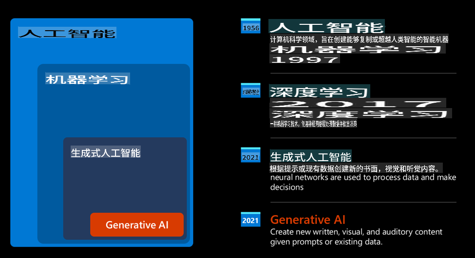
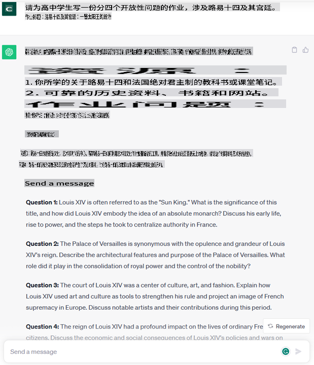
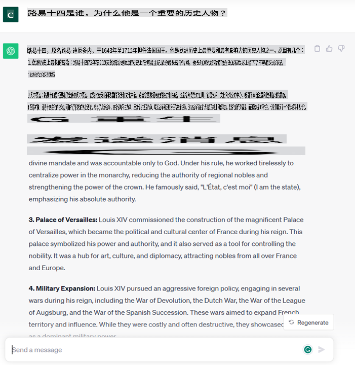

# 生成式AI和大型语言模型介绍

*(点击上面的图像查看此课程的视频)*

生成式AI是一种人工智能，能够生成文本、图像和其他类型的内容。它的奇妙之处在于它使AI民主化，任何人都可以使用它，只需一个自然语言写成的文本提示，就可以使用它。你不需要学习像Java或SQL这样的语言来完成有价值的事情，你只需要使用你的语言，说明你想要什么，AI模型就会给出一个建议。这个技术的应用和影响是巨大的，你可以在几秒钟内编写或理解报告、编写应用程序等等。

在这个课程中，我们将探索我们的创业公司如何利用生成式AI来解锁教育领域的新场景，以及我们如何应对其应用的社会影响和技术限制。

## 介绍

本课程将涵盖以下内容：

* 创业情景介绍：我们的创业公司的想法和使命。
* 生成式AI以及我们如何落地到当前的技术景观。
* 大型语言模型的内部工作原理。
* 大型语言模型的主要能力和实际应用案例。

## 学习目标

完成本课程后，您将了解：

* 生成式AI是什么以及大型语言模型是如何工作的。
* 如何利用大型语言模型进行不同的用例，重点关注教育场景。

## 场景：我们的教育创业公司

生成式人工智能（AI）代表着人工智能技术的巅峰，推动了曾经被认为是不可能的边界。生成式AI模型具有多种功能和应用，但在本课程中，我们将探讨它如何通过虚构的创业公司来革新教育。我们将把这个创业公司称为*我们的创业公司*。我们的创业公司在教育领域工作，具有雄心勃勃的使命宣言：

> *在全球范围内提高学习的可访问性，确保公平获得教育，并为每个学习者提供个性化的学习体验，以满足他们的需求。*

我们的创业公司团队意识到，如果不利用现代化工具中最强大的工具之一——大型语言模型（LLM），就无法实现这个目标。

预计生成式AI将革新我们今天的学习和教学方式，学生将随时随地拥有虚拟教师，提供大量信息和示例，而教师则能够利用创新工具评估学生并给予反馈。

首先，让我们定义一些我们将在整个课程中使用的基本概念和术语。

## 我们如何得到生成式AI？

尽管近来生成式AI模型的*炒作*异常，但这项技术的开发已经有数十年的历史，最早的研究工作可以追溯到60年代。现在，随着AI具有了人类的认知能力，比如[OpenAI ChatGPT](https://openai.com/chatgpt)或[Bing Chat](https://www.microsoft.com/edge/features/bing-chat?WT.mc_id=academic-105485-koreyst)，这也使用了GPT模型进行Bing搜索对话，AI可以进行对话。

回顾一下，AI的最初原型是打字机聊天机器人，依赖于从一组专家中提取的知识库，并将其表示为计算机中的数据。知识库中的答案是由输入文本中出现的关键字触发的。然而，很快就清楚，这种使用打字机聊天机器人的方法并不具有可扩展性。

### AI的统计方法：机器学习

在90年代，随着对文本分析的统计方法的应用，出现了一个转折点。这导致了新算法的开发——称为机器学习——能够从数据中学习模式，而无需进行显式编程。这种方法使机器能够模拟人类语言理解：一个统计模型在文本标签配对上进行训练，使模型能够将未知的输入文本分类为代表消息意图的预定义标签。

### 神经网络和现代虚拟助手

近年来，硬件技术的技术进步，能够处理更大量的数据和更复杂的计算，鼓励了AI领域的研究，导致了高级机器学习算法的开发——称为神经网络或深度学习算法。

神经网络（特别是循环神经网络——RNN）显著增强了自然语言处理能力，使得文本的含义能够以更有意义的方式表示，增强了一个单词在句子中的上下文的价值。

这就是本世纪初诞生的虚拟助手的技术支持，它非常擅长解释人类语言，识别需求，并执行满足需求的操作，例如回答预定义的脚本或使用第三方服务。

### 当下，生成式AI

这就是我们如今所拥有的生成式AI，可以看作是深度学习的一个子集。

经过数十年的AI领域研究，一种新的模型架构——称为*Transformer*——克服了RNN的局限性，能够获取更长的文本序列作为输入。变压器基于注意机制，使模型能够给予其接收到的输入不同的权重，在文本序列中集中最相关的信息，而不考虑它们在文本序列中的顺序。

大多数最近的生成式AI模型——也称为大型语言模型（LLMs），因为它们使用文本输入和输出——确实基于这种架构。这些模型训练于大量来自不同来源（如书籍、文章和网站）的未标记数据，它们可以适应各种任务，并生成具有语法正确性和创造性的文本。因此，它们不仅极大地增强了机器“理解”输入文本的能力，而且还增强了它们生成人类语言原始响应的能力。

## 大型语言模型是如何工作的？

在下一章中，我们将探讨不同类型的生成式AI模型，但现在让我们看看大型语言模型是如何工作的，重点关注OpenAI GPT（生成预训练变压器）模型。

* **分词器，将文本转换为数字**：大型语言模型接收文本作为输入，并生成文本作为输出。但是，作为统计模型，它们与文本序列相比，使用数字更好。这就是为什么在核心模型使用输入之前，每个输入都要经过一个分词器处理的原因。一个token是一块文本——由可变数量的字符组成，因此分词器的主要任务是将输入分割成一组tokens。然后，每个token都与一个token索引映射，该索引是原始文本块的整数编码。

* **预测输出tokens**：给定n个tokens作为输入（最大n因模型而异），模型能够预测一个token作为输出。然后，这个token被合并到下一次迭代的输入中，以扩展窗口的模式，使得用户能够更好地获得一个（或多个）句子作为答案。这就解释了为什么，如果你曾经玩过ChatGPT，你可能会注意到它有时看起来像是停在了句子的中间。

* **选择过程，概率分布**：模型根据当前文本序列后出现的概率选择输出token。这是因为模型根据其训练预测了所有可能的“下一个token”的概率分布。然而，并不总是从结果分布中选择具有最高概率的token。这个选择添加了一定的随机性，以使模型以非确定性的方式运行——对于相同的输入，我们不会得到完全相同的输出。这种随机性的程度被添加以模拟创造性思维的过程，并且可以使用称为温度的模型参数进行调整。

## 我们的创业公司如何利用大型语言模型？

现在，我们更好地了解了大型语言模型的内部工作原理，让我们看看它们可以执行的最常见任务的一些实际示例，着眼于我们的业务场景。

我们说，大型语言模型的主要能力是*从自然语言中的文本输入开始，从头开始生成文本*。

但是，是什么样的文本输入和输出呢？

大型语言模型的输入称为提示，输出称为完成，这个术语是指模型生成下一个token以完成当前输入的机制。我们将深入探讨什么是提示以及如何设计提示以从我们的模型中获得最大的收益。但是，现在，让我们只说提示可能包括：

* 一个指定我们期望从模型中获得的输出类型的**指令**。这个指令有时可能嵌入一些示例或一些附加数据。

    1. 文章、书籍、产品评论等的摘要，以及从非结构化数据中提取见解。

    

     
    
    2. 文章、论文、作业等的创意构思和设计。

    

     
    
* 一个以会话形式提出的**问题**。

 

* 一个**需要完成的文本块**，它隐含地要求写作帮助。

 

* 一段**代码**，连同要求解释和文档化它的要求，或要求生成执行特定任务的代码片段的注释。

 

上面的示例非常简单，不想详尽展示大型语言模型的能力。它们只想展示使用生成式AI的潜力，特别是但不限于教育背景。

此外，生成式AI模型的输出并不完美，有时模型的创造性可能会对它产生反作用，导致输出是一组单词的组合，人类用户可能会将其解释为现实的迷惑，或者它可能是冒犯性的。生成式AI并不智能——至少在更全面的智能定义中，包括批判性和创造性推理或情感智能；它不是确定性的，也不是可信的，因为可能会将虚构内容（如错误的参考资料、内容和陈述）与正确的信息相结合，并以有说服力和自信的方式呈现。在接下来的课程中，我们将处理所有这些限制，并看看我们可以做些什么来缓解它们。

## 任务

你的任务是更多地了解[生成式AI](https://en.wikipedia.org/wiki/Generative_artificial_intelligence?WT.mc_id=academic-105485-koreyst)，并尝试确定一个领域，你将在其中添加生成式AI，而现在还没有它。与以前的方法相比，影响会有何不同？你能做些以前做不了的事情，或者你能更快吗？写一篇300字的摘要，介绍你的梦想AI创业公司，并包括标题，如“问题”，“我如何使用AI”，“影响”和可选的商业计划。

如果你完成了这个任务，你甚至可以准备申请微软的孵化器[Microsoft for Startups Founders Hub](https://www.microsoft.com/startups?WT.mc_id=academic-105485-koreyst)，我们提供Azure、OpenAI、指导和更多的学分，来看看吧！

## 知识检查

关于大型语言模型，哪些是正确的？

1. 你每次得到的确切响应都是一样的。
2. 它完美地完成任务，非常擅长添加数字、生成可用的代码等。
3. 尽管使用相同的提示，响应可能会有所不同。它也很擅长为你提供某些东西的第一稿，无论是文本还是代码。但你需要逐步改进结果。

答案：3，LLM是非确定性的，响应会有所不同，但你可以通过温度设置控制它的变化。你也不应该期望它做到完美，它的作用是为你做一些繁重的工作，这通常意味着你会得到一个很好的第一次尝试，需要逐步改进。

## 做得好！继续学习之旅

完成本课程后，请查看我们的[生成式AI学习收集](https://aka.ms/genai-collection?WT.mc_id=academic-105485-koreyst)，继续提升你的生成式AI知识！

前往第2课，我们将了解如何[探索和比较不同的LLM类型](../02-exploring-and-comparing-different-llms/README.md?WT.mc_id=academic-105485-koreyst)！

免责声明：该翻译是由人工智能模型翻译的，可能不完美。请仔细查看输出并进行必要的更正。