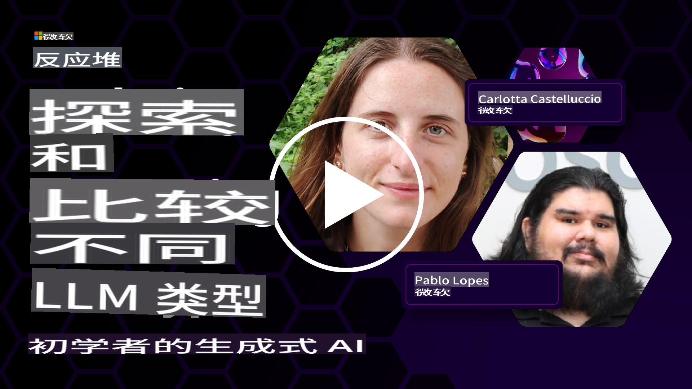
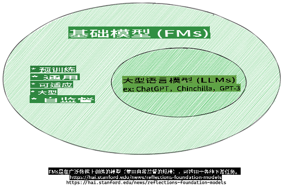
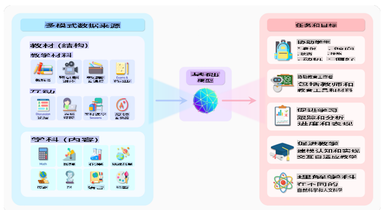
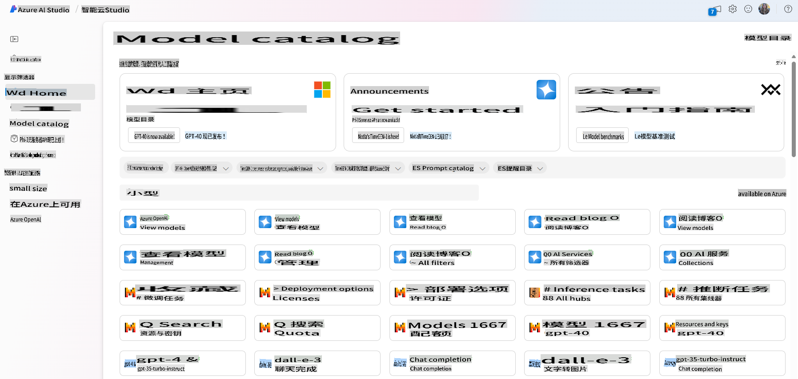

# 探索和比较不同的LLM

> *点击上面的图像查看此课程的视频*

通过上一课，我们已经看到生成式AI如何改变技术领域，大型语言模型（LLMs）的工作原理以及像我们的初创企业这样的企业如何应用它们到他们的用例中并发展！在这一章中，我们将比较和对比不同类型的大型语言模型（LLMs），以了解它们的优缺点。

我们初创企业旅程的下一步是探索当前的LLMs的情况并了解哪些适合我们的用例。

## 介绍

本课程将涵盖以下内容：

- 当前景观中的不同类型的LLMs。
- 在Azure中测试、迭代和比较不同的模型。
- 如何部署LLM。

## 学习目标

完成本课程后，您将能够：

- 选择适合您用例的正确模型。
- 了解如何测试、迭代和改进模型的性能。
- 了解企业如何部署模型。

## 了解不同类型的LLMs

LLMs可以基于它们的架构、训练数据和用例进行多重分类。了解这些差异将帮助我们的初创企业选择适合情景的正确模型，并了解如何测试、迭代和提高性能。

有许多不同类型的LLM模型，您选择的模型取决于您的使用目的、数据、您准备支付多少费用等。

根据您是否打算将模型用于文本、音频、视频、图像生成等，您可能会选择不同类型的模型。

- **音频和语音识别**。对于此目的，Whisper类型模型是一个很好的选择，因为它们是通用型的，并针对语音识别。它在多语言语音识别方面进行了多样化的音频训练。在此处了解有关[Whisper类型模型的更多信息](https://platform.openai.com/docs/models/whisper?WT.mc_id=academic-105485-koreyst)。

- **图像生成**。对于图像生成，DALL-E和Midjourney是两个非常著名的选择。DALL-E由Azure OpenAI提供。[在此处阅读有关DALL-E的更多信息](https://platform.openai.com/docs/models/dall-e?WT.mc_id=academic-105485-koreyst)，也可以在本课程的第9章中了解更多信息。

- **文本生成**。大多数模型都是针对文本生成进行训练的，您可以从GPT-3.5到GPT-4中选择各种选择。它们的成本不同，其中GPT-4是最昂贵的。值得研究一下[Azure OpenAI playground](https://oai.azure.com/portal/playground?WT.mc_id=academic-105485-koreyst)，以评估哪些模型最符合您在功能和成本方面的需求。

- **多模态**。如果您希望处理多种类型的输入和输出数据，您可能需要查看像[gpt-4 turbo with vision或gpt-4o](https://learn.microsoft.com/azure/ai-services/openai/concepts/models#gpt-4-and-gpt-4-turbo-models?WT.mc_id=academic-105485-koreyst)这样的模型 - OpenAI模型的最新版本 - 它们能够将自然语言处理与视觉理解相结合，通过多模态接口实现交互。

选择模型意味着您获得了一些基本功能，但这可能不足够。通常，您具有公司特定的数据，您需要告诉LLM该数据。有几种不同的选择方法，即将在即将到来的章节中详细介绍。

### 基础模型与LLMs

术语“基础模型”是由斯坦福研究人员[创造的](https://arxiv.org/abs/2108.07258?WT.mc_id=academic-105485-koreyst)，并定义为遵循某些标准的AI模型，例如：

- **它们使用无监督学习或自我监督学习进行训练**，这意味着它们在未标记的多模态数据上进行训练，并且它们的训练过程不需要人类注释或标记的数据。
- **它们是非常大的模型**，基于训练了数十亿个参数的非常深的神经网络。
- **它们通常旨在为其他模型提供“基础”**，这意味着它们可以用作其他模型的起点，可以通过微调来构建其他模型。

图像来源：[Essential Guide to Foundation Models and Large Language Models | by Babar M Bhatti | Medium](https://thebabar.medium.com/essential-guide-to-foundation-models-and-large-language-models-27dab58f7404)

为了进一步澄清这一区别，让我们以ChatGPT为例。为了构建ChatGPT的第一个版本，使用了一个名为GPT-3.5的模型作为基础模型。这意味着OpenAI使用了一些特定于聊天的数据来创建GPT-3.5的调整版本，该版本专门用于在对话场景中表现良好，例如聊天机器人。

图像来源：[2108.07258.pdf (arxiv.org)](https://arxiv.org/pdf/2108.07258.pdf?WT.mc_id=academic-105485-koreyst)

### 开源与专有模型

另一种将LLMs分类的方法是它们是开源还是专有。

开源模型是向公众提供的模型，任何人都可以使用它们。它们通常由创建它们的公司或研究社区提供。这些模型允许进行检查、修改和定制，以满足LLMs的各种用例。但是，它们并不总是针对生产使用进行优化，并且可能不像专有模型那样高效。此外，开源模型的资金可能有限，并且可能长期不会得到维护，或者可能不会更新为最新的研究成果。流行的开源模型的例子包括[Alpaca](https://crfm.stanford.edu/2023/03/13/alpaca.html?WT.mc_id=academic-105485-koreyst)、[Bloom](https://sapling.ai/llm/bloom?WT.mc_id=academic-105485-koreyst)和[LLaMA](https://sapling.ai/llm/llama?WT.mc_id=academic-105485-koreyst)。

专有模型是由公司拥有并且不向公众提供的模型。这些模型通常针对生产使用进行了优化。但是，它们不允许进行检查、修改或针对不同用例进行定制。此外，它们并不总是免费提供，并且可能需要订阅或付款才能使用。此外，用户无法控制用于训练模型的数据，这意味着他们应该信任模型所有者确保数据隐私和负责任的AI使用。流行的专有模型包括[OpenAI模型](https://platform.openai.com/docs/models/overview?WT.mc_id=academic-105485-koreyst)、[Google Bard](https://sapling.ai/llm/bard?WT.mc_id=academic-105485-koreyst)或[Claude 2](https://www.anthropic.com/index/claude-2?WT.mc_id=academic-105485-koreyst)。

### 嵌入式与图像生成与文本和代码生成

LLMs还可以通过它们生成的输出进行分类。

嵌入式是一组可以将文本转换为数字形式（称为嵌入式）的模型，嵌入式是输入文本的数字表示形式。嵌入使机器更容易理解单词或句子之间的关系，并且可以被其他模型消耗为输入，例如分类模型或聚类模型，在数值数据上具有更好的性能。嵌入模型通常用于转移学习，其中为代理任务构建模型，该任务具有大量数据，然后重复使用模型权重（嵌入）以用于其他下游任务。此类别的一个例子是[OpenAI嵌入](https://platform.openai.com/docs/models/embeddings?WT.mc_id=academic-105485-koreyst)。

图像生成模型是生成图像的模型。这些模型通常用于图像编辑、图像合成和图像翻译。图像生成模型通常在大型图像数据集（例如[LAION-5B](https://laion.ai/blog/laion-5b/?WT.mc_id=academic-105485-koreyst)）上进行训练，并可用于生成新图像或使用修复、超分辨率和着色技术编辑现有图像。示例包括[DALL-E-3](https://openai.com/dall-e-3?WT.mc_id=academic-105485-koreyst)和[稳定扩散模型](https://github.com/Stability-AI/StableDiffusion?WT.mc_id=academic-105485-koreyst)。

文本和代码生成模型是生成文本或代码的模型。这些模型通常用于文本摘要、翻译和问答。文本生成模型通常在大型文本数据集（例如[BookCorpus](https://www.cv-foundation.org/openaccess/content_iccv_2015/html/Zhu_Aligning_Books_and_ICCV_2015_paper.html?WT.mc_id=academic-105485-koreyst)）上进行训练，并可用于生成新文本或回答问题。代码生成模型（例如[CodeParrot](https://huggingface.co/codeparrot?WT.mc_id=academic-105485-koreyst)）通常在大型代码数据集（例如GitHub）上进行训练，并可用于生成新代码或修复现有代码中的错误。

### 编码器-解码器与仅解码器

为了讨论LLMs的不同架构类型，让我们使用一个类比。

想象一下，您的经理给您一个任务，让您为学生编写一份测验。您有两个同事；一个负责创建内容，另一个负责审核。

内容创建者就像是一个仅解码器模型，他可以查看主题并查看您已经编写的内容，然后根据此编写课程。他非常擅长编写引人入胜和信息丰富的内容，但是他不擅长理解主题和学习目标。一些解码器模型的例子是GPT系列模型，例如GPT-3。

审核员就像是一个仅编码器模型，他查看编写的课程和答案，注意它们之间的关系并理解上下文，但他不擅长生成内容。仅编码器模型的例子是BERT。

想象一下，我们还可以有一个人可以创建和审核测验，这就是编码器-解码器模型。一些例子是BART和T5。

### 服务与模型

现在，让我们谈谈服务和模型之间的区别。服务是由云服务提供商提供的产品，通常是模型、数据和其他组件的组合。模型是服务的核心组件，通常是基础模型，例如LLM。

服务通常针对生产使用进行优化，并且通常比模型更易于使用，通过图形用户界面实现。但是，服务并不总是免费提供，并且可能需要订阅或付款才能使用，以换取利用服务所有者的设备和资源，优化开支和轻松扩展。服务的一个例子是[Azure OpenAI服务](https://learn.microsoft.com/azure/ai-services/openai/overview?WT.mc_id=academic-105485-koreyst)，它提供按使用量付费的费率计划，这意味着用户按比例收取使用服务的费用。此外，Azure OpenAI服务还在模型的功能之上提供企业级安全和负责任的AI框架。

模型只是神经网络，具有参数、权重等。允许公司在本地运行，但需要购买设备、构建结构以扩展并购买许可证或使用开源模型。像LLaMA这样的模型可供使用，需要计算能力来运行模型。

## 如何在Azure上测试和迭代不同的模型以了解性能

一旦我们的团队探索了当前的LLMs景观并确定了一些适合其情景的好候选模型，下一步是在其数据和工作负载上对其进行测试。这是一个迭代过程，通过实验和测量来完成。我们在前面的段落中提到的大多数模型（OpenAI模型、开源模型如Llama2和Hugging Face transformers）都可以在[Azure AI Studio](https://ai.azure.com/?WT.mc_id=academic-105485-koreyst)的[模型目录](https://learn.microsoft.com/azure/ai-studio/how-to/model-catalog-overview?WT.mc_id=academic-105485-koreyst)中找到。

[Azure AI Studio](https://learn.microsoft.com/azure/ai-studio/what-is-ai-studio?WT.mc_id=academic-105485-koreyst)是一个云平台，专为开发人员构建生成式AI应用程序并管理整个开发生命周期而设计的，从实验到评估，将所有Azure AI服务组合成一个单一的中心，具有方便的GUI。 Azure AI Studio中的模型目录使用户能够：

- 在目录中查找感兴趣的基础模型-专有或开源，通过任务、许可证或名称进行筛选。为了提高可搜索性，模型被组织成集合，例如Azure OpenAI集合、Hugging Face集合等。

- 查看模型卡，包括详细的描述预期使用和训练数据、代码示例和对内部评估库的评估结果。

- 比较行业中可用的模型和数据集的基准，以评估哪个符合业务
根据用户的期望，答案将会是什么？在这种情况下，如果提示只包括一个例子，我们谈论的是“一次性学习”，如果包括多个例子，我们谈论的是“少量学习”。在具有上下文的提示工程方面，这是一种最具成本效益的方法。### 检索增强生成（RAG）LLMs的局限性在于它们只能使用在训练过程中使用过的数据来生成答案。这意味着它们对训练过程之后发生的事实一无所知，并且无法访问非公开信息（如公司数据）。这可以通过RAG来克服，这是一种将外部数据以文档块的形式增强提示的技术，考虑到提示长度限制。这得到了向量数据库工具（如[Azure向量搜索](https://learn.microsoft.com/azure/search/vector-search-overview?WT.mc_id=academic-105485-koreyst)）的支持，它们从各种预定义的数据源中检索有用的块，并将它们添加到提示上下文中。当企业没有足够的数据、时间或资源来微调LLM，但仍希望在特定工作负载上提高性能并降低虚构、即现实或有害内容的风险时，这种技术非常有帮助。### 微调模型微调是一种利用迁移学习来“调整”模型以进行下游任务或解决特定问题的过程。与少量学习和RAG不同，它会生成一个新的模型，具有更新的权重和偏差。它需要一组训练示例，包括单个输入（提示）及其相关输出（完成）。如果：- **使用微调模型**。企业希望使用微调能力较弱的模型（如嵌入模型）而不是高性能模型，从而获得更具成本效益和快速的解决方案。- **考虑延迟**。延迟对于特定的用例很重要，因此无法使用非常长的提示或要从模型中学习的示例数量不符合提示长度限制。- **保持最新状态**。企业拥有大量高质量的数据和地面真相标签，并具备维护这些数据随时间更新所需的资源。### 训练模型从头开始训练LLM无疑是采取的最困难和最复杂的方法，需要大量的数据、熟练的资源和适当的计算能力。只有在业务具有特定领域用例和大量领域中心数据的情况下，才应考虑这个选项。## 知识检查如何改善LLM完成结果的好方法是什么？1. 具有上下文的提示工程1. RAG1. 微调模型A:3，如果您有时间、资源和高质量的数据，微调是保持最新状态的更好选择。然而，如果您正在寻求改进并且缺乏时间，考虑首先使用RAG是值得的。## 🚀挑战了解如何为您的业务[使用RAG](https://learn.microsoft.com/azure/search/retrieval-augmented-generation-overview?WT.mc_id=academic-105485-koreyst)。## 做得好，继续学习完成本课程后，请查看我们的[生成AI学习集合](https://aka.ms/genai-collection?WT.mc_id=academic-105485-koreyst)，继续提高您的生成AI知识水平！前往第3课，我们将学习如何[负责任地使用生成AI构建](../03-using-generative-ai-responsibly/README.md?WT.mc_id=academic-105485-koreyst)！

免责声明：本翻译是由AI模型翻译而来，可能不完美。请仔细检查输出并进行必要的更正。