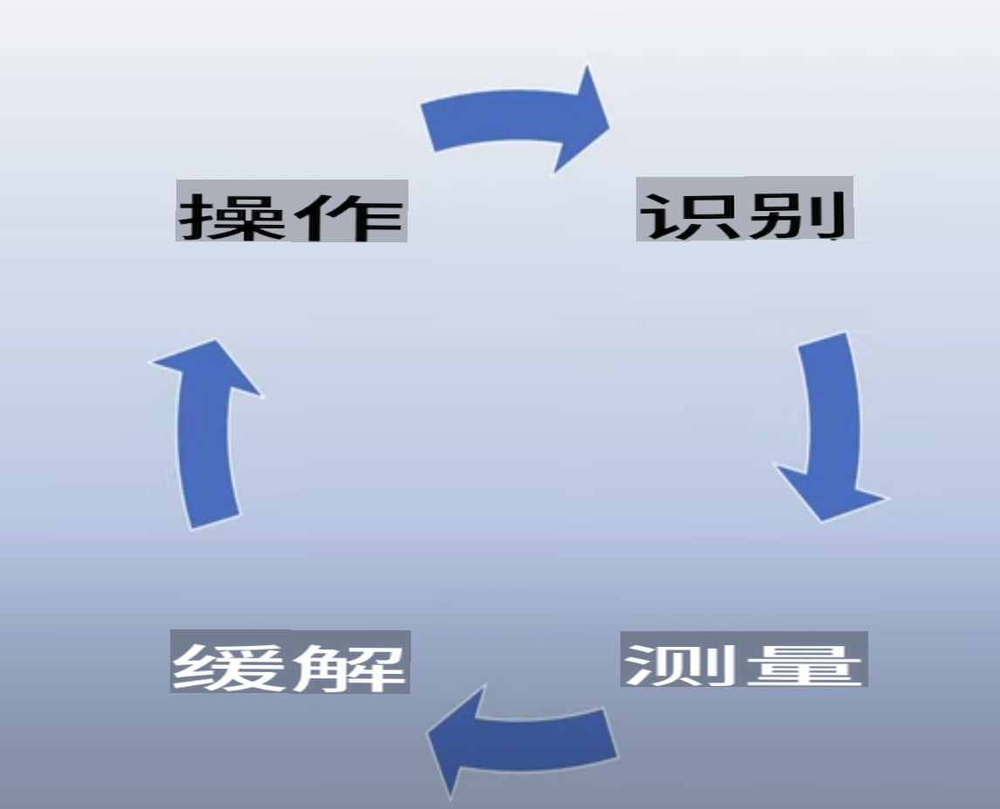

# 负责任地使用生成型AI

 

> **即将发布视频**

AI和生成型AI特别令人着迷，但您需要考虑如何负责任地使用它。您需要考虑如何确保输出是公平、无害等等。本章旨在为您提供上下文、需要考虑的事项以及如何采取积极措施来改善您的AI使用。

## 介绍

本课程将介绍：

- 为什么在构建生成型AI应用程序时应优先考虑负责任的AI。
- 负责任AI的核心原则以及它们与生成型AI的关系。
- 如何通过战略和工具将这些负责任AI原则付诸实践。

## 学习目标

完成本课程后，您将了解：

- 在构建生成型AI应用程序时，负责任AI的重要性。
- 在构建生成型AI应用程序时何时思考和应用负责任AI的核心原则。
- 有哪些工具和策略可供您将负责任AI的概念付诸实践。

## 负责任AI原则

生成型AI的兴奋点从未像现在这样高。这种兴奋带来了许多新的开发人员、关注和资金。虽然这对于任何想要使用生成型AI构建产品和公司的人来说都非常积极，但我们也需要负责任地继续前进。

在本课程中，我们专注于构建我们的创业公司和我们的AI教育产品。我们将使用负责任AI的原则：公平性、包容性、可靠性/安全性、安全和隐私、透明度和问责制。通过这些原则，我们将探讨它们如何与我们在产品中使用生成型AI相关联。

## 为什么应该优先考虑负责任AI

在构建产品时，通过以用户为中心的方法，以用户的最佳利益为考虑，可以取得最佳结果。

生成型AI的独特之处在于其创造对用户有帮助的答案、信息、指导和内容的能力。这可以在没有许多手动步骤的情况下完成，从而可以产生非常令人印象深刻的结果。但是，如果没有适当的计划和策略，它也可能不幸地导致对您的用户、产品和整个社会造成一些有害的结果。

让我们看看一些（但不是全部）潜在的有害结果：

### 幻觉

“幻觉”是一个术语，用于描述LLM产生的内容是完全没有意义的或者基于其他信息来源我们知道是事实错误的。

例如，我们为我们的创业公司构建了一个功能，允许学生向模型提出历史问题。一个学生提出了问题“泰坦尼克号的唯一幸存者是谁？”

模型会产生像下面这样的响应：

> *(来源：[Flying bisons](https://flyingbisons.com?WT.mc_id=academic-105485-koreyst))*

这是一个非常自信和详尽的答案。不幸的是，这是不正确的。即使进行了最少量的研究，人们也会发现泰坦尼克号灾难的幸存者不止一个。对于刚开始研究这个主题的学生来说，这个答案可能足够具有说服力，不会被质疑并被视为事实。这样做的后果可能导致AI系统不可靠，对我们创业公司的声誉产生负面影响。

通过每次迭代给定LLM，我们已经看到了减少幻觉的性能改进。即使有了这种改进，作为应用程序构建者和用户，我们仍然需要意识到这些限制。

### 有害内容

我们在前面的部分中介绍了当LLM产生不正确或没有意义的响应时的风险。我们需要注意的另一个风险是当模型以有害内容响应时。

有害内容可以定义为：

- 提供指导或鼓励自残或伤害某些群体。
- 充满仇恨或贬低的内容。
- 指导策划任何类型的攻击或暴力行为。
- 提供有关如何查找非法内容或犯罪行为的指导。
- 显示性爱内容。

对于我们的创业公司，我们希望确保我们有正确的工具和策略，以防止学生看到此类内容。

### 公平性不足

公平性被定义为“确保AI系统没有偏见和歧视，并且它们公平和平等地对待每个人。”在生成型AI的世界中，我们希望确保边缘化群体的排斥性世界观不会被模型的输出强化。

这些类型的输出不仅对我们的用户构建积极的产品体验是破坏性的，而且会导致进一步的社会伤害。作为应用程序构建者，在使用生成型AI构建解决方案时，我们应始终牢记广泛和多样化的用户群体。

## 如何负责任地使用生成型AI

现在我们已经确定了负责任的生成型AI的重要性，让我们看看我们可以采取哪些步骤来负责任地构建我们的AI解决方案：

### 量化潜在危害

在软件测试中，我们测试用户在应用程序上的预期操作。同样，测试用户最有可能使用的各种提示是衡量潜在危害的好方法。

由于我们的创业公司正在构建教育产品，因此准备教育相关提示的列表会很有用。这可以涵盖某个主题、历史事实以及有关学生生活的提示。

### 减轻潜在危害

现在是时候找到方法来防止或限制模型及其响应引起的潜在危害。我们可以从4个不同的层面来看待这个问题：

- **模型**。为正确的用例选择正确的模型。像GPT-4这样更大、更复杂的模型在应用于更小、更具体的用例时可能会导致更多的有害内容风险。使用训练数据进行微调也可以减少有害内容的风险。

- **安全系统**。安全系统是平台上提供模型服务的一组工具和配置，可帮助减轻危害。Azure OpenAI服务上的内容过滤系统就是一个例子。系统还应检测越狱攻击和不需要的活动，如来自机器人的请求。

- **元提示**。元提示和接地是我们可以根据某些行为和信息引导或限制模型的方式。这可以是使用系统输入来定义模型的某些限制。此外，提供更与系统范围或领域相关的输出。

 还可以使用Retrieval Augmented Generation（RAG）等技术，使模型仅从一组可信源中提取信息。本课程后面有一节关于[构建搜索应用程序](../08-building-search-applications/README.md?WT.mc_id=academic-105485-koreyst)的课程。

- **用户体验**。最后一层是用户通过我们应用程序的界面以某种方式直接与模型交互。通过这种方式，我们可以设计UI / UX，限制用户发送给模型的输入类型以及向用户显示的文本或图像。在部署AI应用程序时，我们还必须透明地说明我们的生成型AI应用程序能够做什么和不能做什么。

我们有一个完整的课程专门介绍[为AI应用程序设计UX](../12-designing-ux-for-ai-applications/README.md?WT.mc_id=academic-105485-koreyst)

- **评估模型**。使用LLMs进行工作可能很具有挑战性，因为我们并不总是控制模型训练的数据。无论如何，我们应始终评估模型的性能和输出。仍然重要的是测量模型的准确性、相似性、接地性和输出的相关性。这有助于向利益相关者和用户提供透明度和信任。

### 运行负责任的生成型AI解决方案

建立围绕您的AI应用程序的运营实践是最后一阶段。这包括与我们创业公司的其他部分（如法律和安全）合作，以确保我们符合所有监管政策。在启动之前，我们还要制定有关交付、处理事件和回滚的计划，以防止对我们的用户造成任何伤害。

## 工具

尽管开发负责任的AI解决方案的工作似乎很多，但这是值得付出努力的工作。随着生成型AI领域的发展，更多的工具将帮助开发人员有效地将责任整合到其工作流程中。例如，[Azure AI内容安全](https://learn.microsoft.com/azure/ai-services/content-safety/overview?WT.mc_id=academic-105485-koreyst )可以通过API请求帮助检测有害内容和图像。

## 知识检查

为确保负责任的AI使用，您需要关注哪些事项？

1. 答案是否正确。
1. 有害用途，即AI不用于犯罪目的。
1. 确保AI没有偏见和歧视。

A：2和3是正确的。负责任AI帮助您考虑如何减轻有害影响和偏见等。

## 🚀 挑战

阅读有关[Azure AI内容安全](https://learn.microsoft.com/azure/ai-services/content-safety/overview?WT.mc_id=academic-105485-koreyst)的内容，看看您可以采用什么。

## 做得好，请继续学习

完成本课程后，请查看我们的[生成型AI学习集合](https://aka.ms/genai-collection?WT.mc_id=academic-105485-koreyst)，继续提高您的生成型AI知识水平！

请前往第4课，我们将学习[提示工程基础知识](../04-prompt-engineering-fundamentals/README.md?WT.mc_id=academic-105485-koreyst)!

免责声明：该翻译是由AI模型翻译的，可能不完美。请检查输出并进行必要的更正。